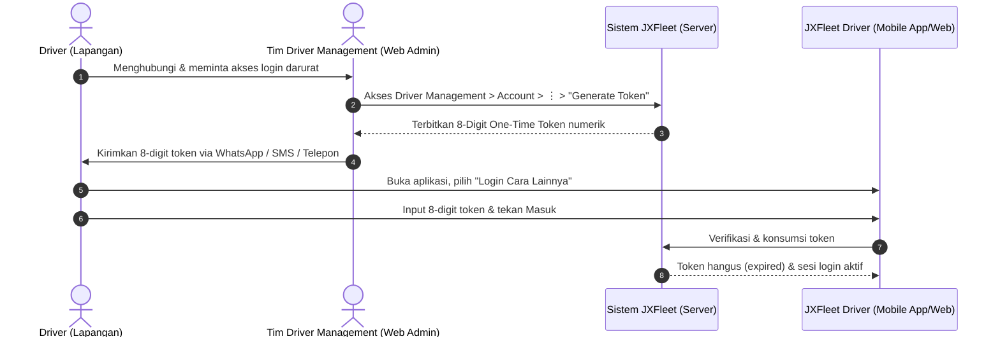

# Panduan Generate One-Time Login Token Driver

Panduan ini ditujukan bagi tim **Driver Management** dan Administrator untuk menerbitkan kode token masuk sekali pakai (*One-Time Login Token 8-Digit*) bagi mitra pengemudi (*driver*) yang membutuhkan akses darurat ke aplikasi **JXFleet Driver** atau Mobile Web tanpa harus melakukan pengaturan ulang (*reset*) PIN akun.

---

!!! important "Batasan & Karakteristik Token (Constraints)"
    - **Otorisasi Khusus (Role-Based Access)**: Pembuatan token darurat hanya dapat dilakukan oleh pengguna dengan kewenangan peran (*role*) **Driver Management** atau **Super Admin**.
    - **Platform Akses**: Dilakukan melalui portal komputer (*Desktop Web*) di [web.jxfleet.com](https://web.jxfleet.com).
    - **Sifat Sekali Pakai (*Single-Use*)**: Token hanya berlaku untuk **1 (satu) kali login**. Setelah driver berhasil masuk ke sistem menggunakan token tersebut, token otomatis kedaluwarsa (*invalid*) dan tidak dapat digunakan kembali.
    - **Tidak Mengubah PIN Akun**: Pemakaian One-Time Token tidak memengaruhi atau mengubah PIN akun driver yang tersimpan di sistem.

---

## 🔄 Alur Kerja One-Time Login Token

Diagram berikut mengilustrasikan alur koordinasi antara mitra pengemudi, tim Driver Management, dan sistem JXFleet:

---

## 🛠️ Langkah-Langkah Penerbitan One-Time Token

### 1. Mengakses Menu Akun Driver
Masuk ke peramban di [web.jxfleet.com](https://web.jxfleet.com) menggunakan akun operasional Anda. Pada menu navigasi utama di bilah sisi kiri, pilih:
> **Driver Management** ➔ **Account**

---

### 2. Mencari & Menemukan Akun Driver
Gunakan kolom pencarian di bagian atas tabel untuk mencari akun driver yang membutuhkan bantuan akses masuk. Anda dapat mencari berdasarkan salah satu kriteria berikut:
- **Nama Driver**
- **Nomor Handphone Terdaftar** (format diawali kode negara `62`)
- **Alamat Email**
- **Region Operasional**

Setelah data driver yang dituju ditemukan:
1. Geser ke kolom aksi di sisi paling kanan baris data.
2. Klik tombol menu **Tiga Titik (Triple Dot / `⋮`)**.
3. Pilih opsi **Generate Token**.

---

### 3. Menyalin 8-Digit Token yang Diterbitkan
1. Sistem akan menampilkan jendela sembulan (*pop-up dialog*) konfirmasi yang memuat **8-digit kode token numerik**.
2. Klik tombol salin (*copy*) atau catat dengan teliti 8-digit kode token tersebut.

---

### 4. Menyerahkan Token & Memandu Driver Masuk
1. Kirimkan 8-digit token tersebut kepada rekan driver melalui saluran komunikasi resmi internal (WhatsApp, SMS, atau panggilan telepon).
2. Arahkan driver untuk membuka aplikasi **JXFleet Driver** atau Mobile Web pada ponselnya.
3. Instruksikan driver untuk memilih menu **Login Cara Lainnya** pada halaman awal aplikasi.
4. Driver memasukkan atau menempelkan (*paste*) 8-digit kode token tersebut, lalu menekan tombol masuk.
5. Driver akan langsung masuk ke halaman utama aplikasi dan siap menerima instruksi penugasan armada tanpa hambatan autentikasi.

---

## 📋 Tabel Ketentuan & Spesifikasi Token

| Parameter | Spesifikasi / Aturan | Keterangan Operasional |
| :--- | :--- | :--- |
| **Format Kode** | 8-Digit Angka (*Numeric*) | Diterbitkan otomatis dan acak oleh sistem JXFleet |
| **Masa Pakai** | 1x Pakai (*Single-Use*) | Otomatis hangus seketika setelah berhasil digunakan masuk |
| **Alur Masuk Driver** | Menu *Login Cara Lainnya* | Khusus diakses via Mobile App atau Mobile Web |
| **Status Kredensial** | PIN Driver Tetap Utuh | Tidak mengubah atau mereset PIN akun driver di database |
| **Platform Penerbitan** | Desktop Web ([web.jxfleet.com](https://web.jxfleet.com)) | Hanya oleh akun berotorisasi Driver Management / Super Admin |

---

## 💡 Praktik Terbaik & Keamanan Operasional

!!! tip "Rekomendasi Operasional"
    - **Verifikasi Identitas**: Selalu pastikan identitas pengemudi dan nomor polisi kendaraan penugasan sebelum menerbitkan token untuk mencegah penyalahgunaan akses armada.
    - **Sesi Darurat Sementara**: Jika driver memerlukan solusi permanen untuk login sehari-hari berikutnya karena lupa PIN, arahkan tim untuk melakukan prosedur penyetelan ulang PIN melalui panduan [Reset PIN Driver](reset-pin-driver.md).
    - **Dokumentasi Terkait**: Pelajari juga ringkasan alur pemulihan kata sandi pengguna platform pada panduan [Lupa Password & PIN JXFleet](../login/lupa-password-pin.md).

---