# Panduan Login JXFleet

Panduan ini menjelaskan alur masuk (*login*) ke platform **JXFleet** untuk seluruh pengguna (Admin, Tim Ops, dan Driver) di berbagai perangkat.

---

!!! important "Persyaratan Pendaftaran & Kredensial"
    Pastikan nomor handphone yang Anda gunakan telah didaftarkan terlebih dahulu oleh **Tim Pengembang JXFleet (JXFleet Developer Team)**.
    
    - **Akses Komputer (Desktop Web)**: Menggunakan **Password**.
    - **Akses Mobile (App & Web)**: Menggunakan **PIN 6-digit** (PIN default pertama kali: `123456`) atau **One-Time Token 8-digit**.

---

=== "💻 Komputer (Desktop Web)"

    ### Langkah-Langkah Login via Desktop Web:

    | Langkah & Instruksi | Tampilan Layar |
    | :--- | :---: |
    | **1.** Buka peramban (*browser*) di komputer Anda dan akses halaman [web.jxfleet.com](https://web.jxfleet.com). | { style="height: 250px;" } |
    | **2.** Masukkan email terdaftar atau nomor handphone terdaftar (diawali `62`), masukkan **Password** akun Anda, lalu klik tombol **Login**. | 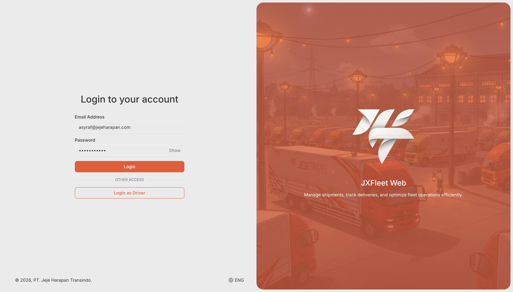{ style="height: 250px;" } |
    | **3.** Setelah verifikasi berhasil, Anda akan diarahkan langsung ke **Tampilan Pertama Web Desktop**. | 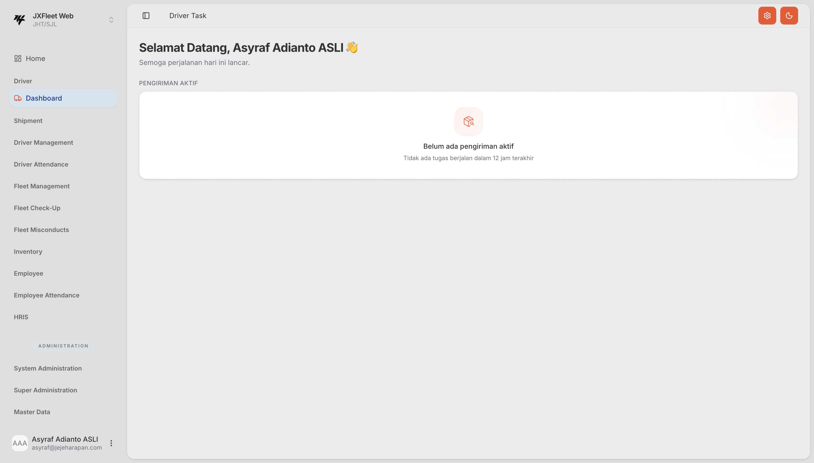{ style="height: 250px;" } |

=== "📱 Mobile App (Android / iOS)"

    ### A. Login Standar (Menggunakan PIN):

    | Langkah & Instruksi | Tampilan Layar |
    | :--- | :---: |
    | **1.** Buka aplikasi **JXFleet Driver** di ponsel Anda. Masukkan nomor HP yang telah terdaftar pada Tim Pengembang JXFleet (contoh: `628123456789`), lalu tekan tombol **Login**. | 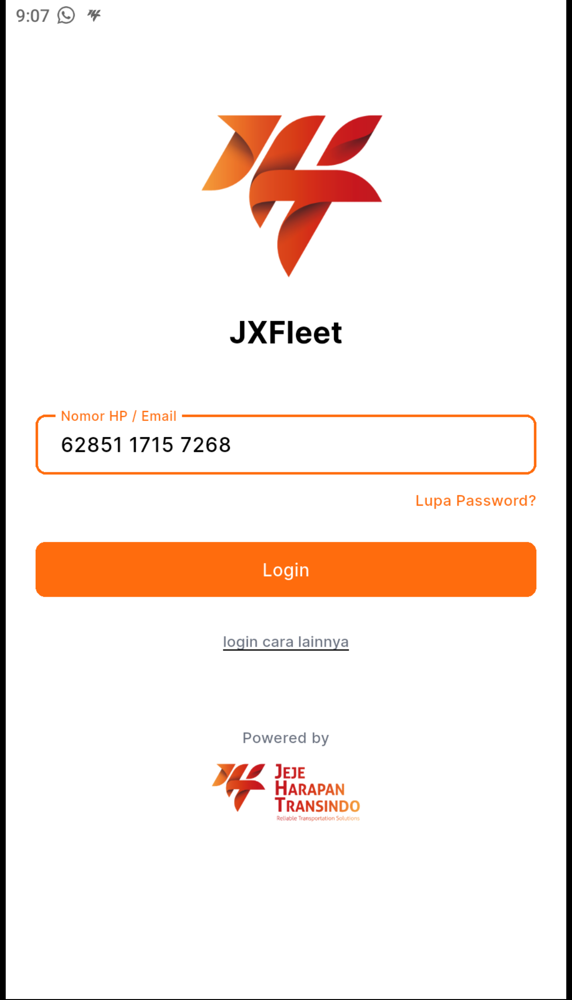{ style="height: 250px;" } |
    | **2.** Masukkan 6-digit PIN akun Anda. Jika ini pertama kali login, gunakan PIN bawaan `123456`. | 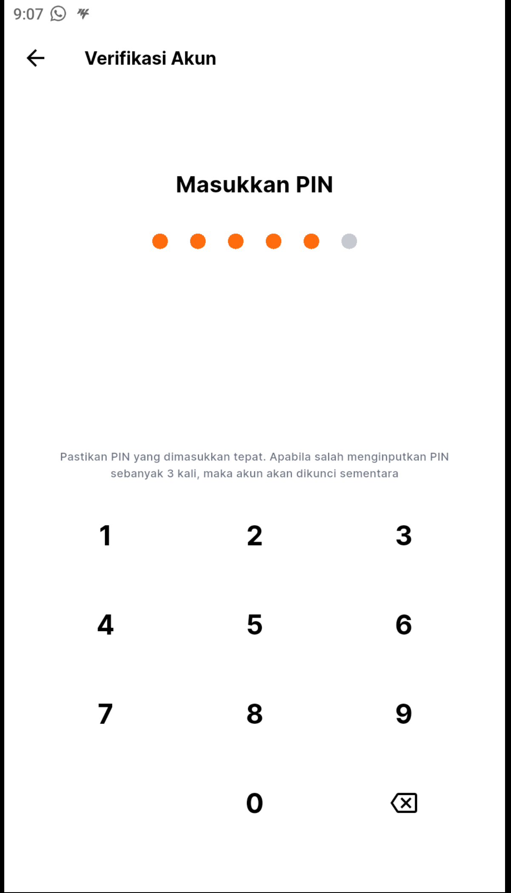{ style="height: 250px;" } |
    | **3.** Setelah verifikasi sukses, Anda akan masuk ke halaman utama aplikasi dan siap menerima penugasan. | 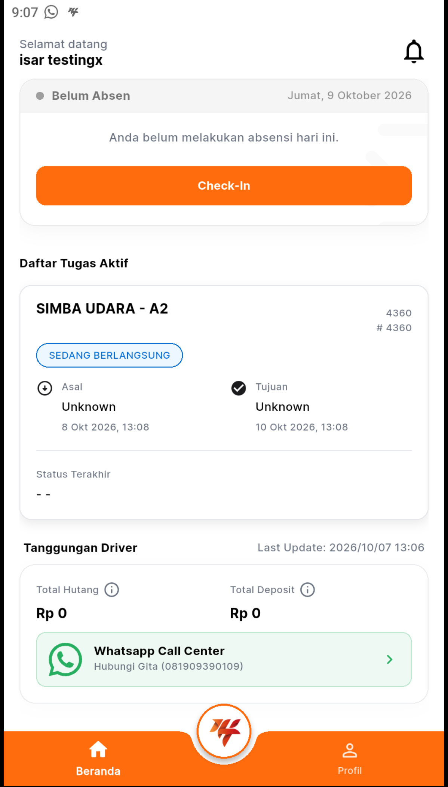{ style="height: 250px;" } |

    ---

    ### B. Alternatif: Login dengan One-Time Token (Akses Cepat):

    !!! tip "Akses Instan Tanpa Reset PIN"
        Gunakan metode ini jika Anda mengalami lupa PIN akun dan ingin langsung mengakses aplikasi secara cepat tanpa perlu melakukan proses reset PIN terlebih dahulu.

    | Langkah & Instruksi | Tampilan Layar |
    | :--- | :---: |
    | **1.** Dapatkan **8-digit One-Time Token** dari Tim Pengembang JXFleet / Admin Support. | *(Diberikan oleh Admin / Support)* |
    | **2.** Pada halaman awal aplikasi **JXFleet Driver**, tekan tombol **Login Cara Lainnya**. | 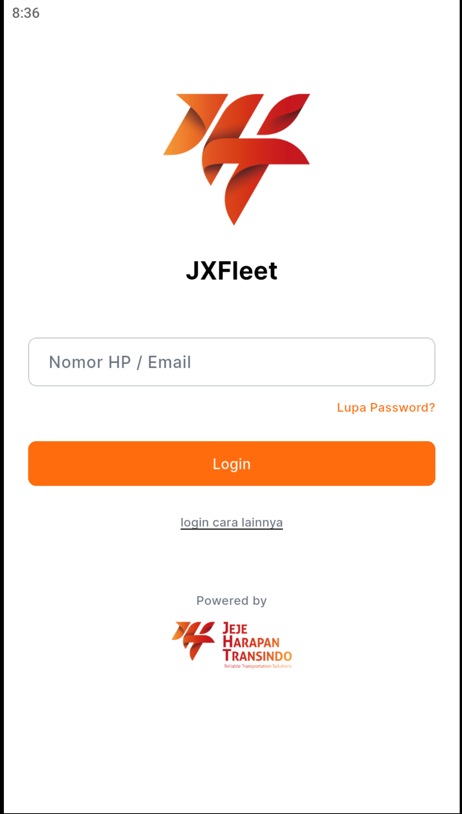{ style="height: 250px;" } |
    | **3.** Tempel (*paste*) atau masukkan 8-digit One-Time Token yang Anda dapatkan. | 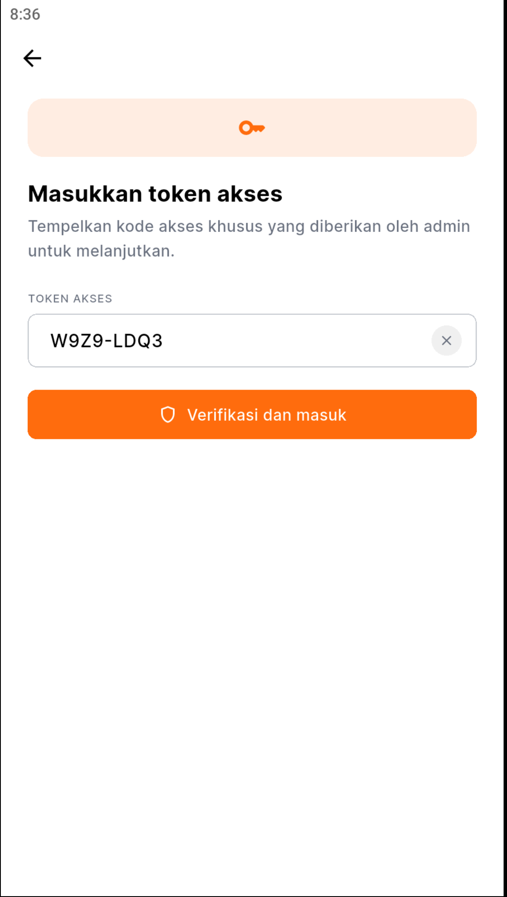{ style="height: 250px;" } |
    | **4.** Berhasil masuk ke halaman utama aplikasi. | 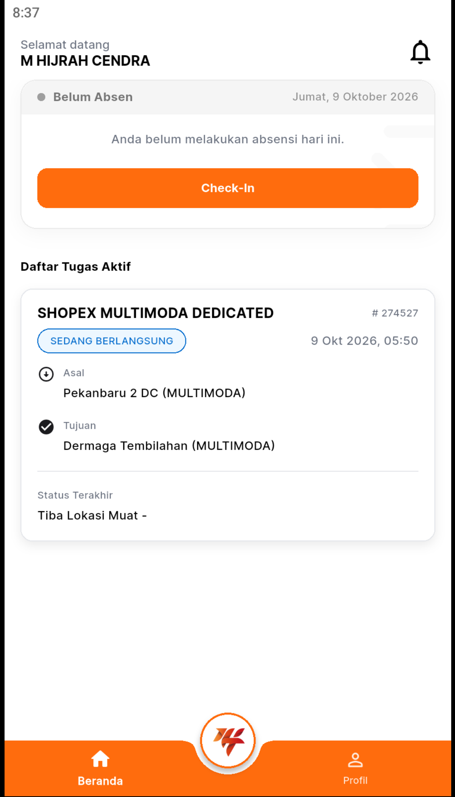{ style="height: 250px;" } |

=== "🌐 Mobile Web"

    ### A. Login Standar (Menggunakan PIN):

    | Langkah & Instruksi | Tampilan Layar |
    | :--- | :---: |
    | **1.** Buka browser di ponsel (Chrome/Safari), lalu akses `web.jxfleet.com`. Pilih menu **Login as Driver**. | 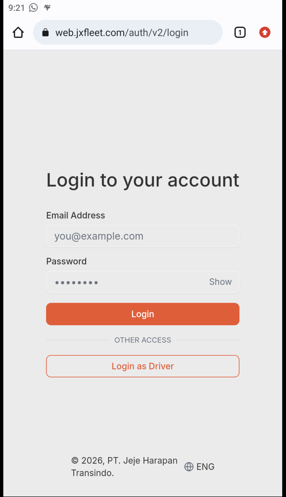{ style="height: 250px;" } |
    | **2.** Masukkan nomor HP yang telah terdaftar pada Tim Pengembang JXFleet (diawali `62`), lalu tekan tombol **Lanjut**. | 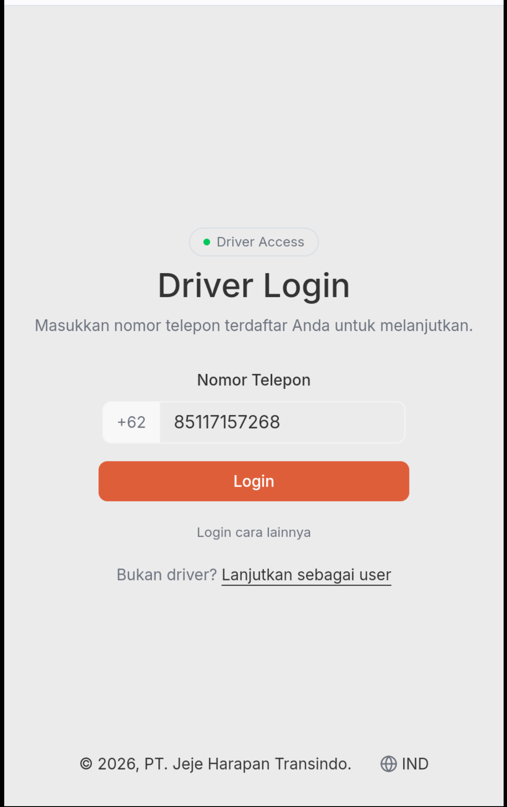{ style="height: 250px;" } |
    | **3.** Masukkan PIN 6-digit akun Anda, lalu tekan **Login** | 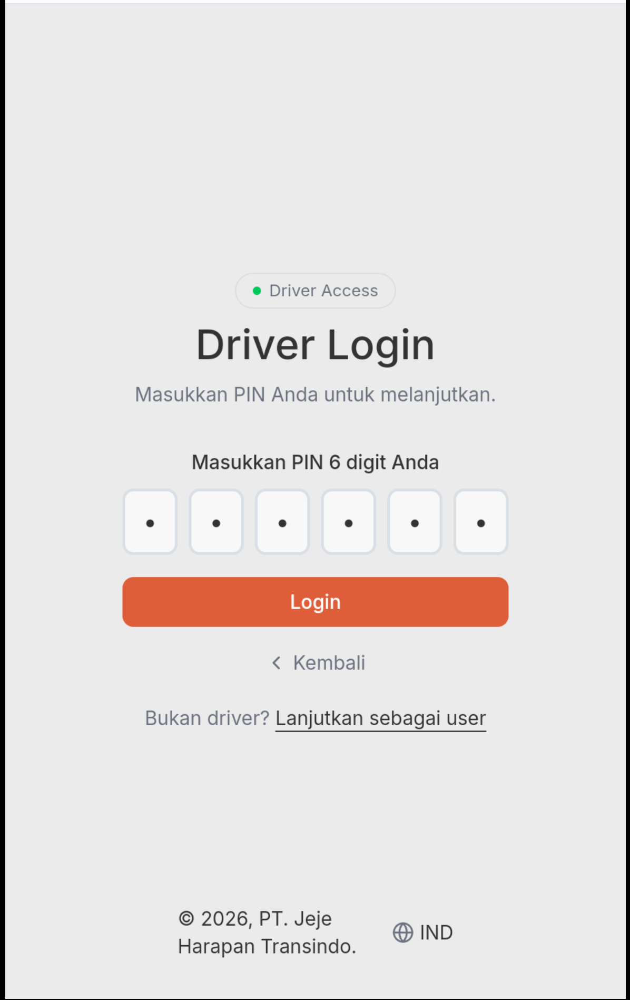{ style="height: 250px;" } |
    | **4.** Berhasil masuk ke halaman dashboard Mobile Web. | { style="height: 250px;" } |

    ---

    ### B. Alternatif: Login dengan One-Time Token (Akses Cepat):

    !!! tip "Akses Instan Tanpa Reset PIN"
        Gunakan metode ini jika Anda lupa PIN akun dan butuh masuk ke Mobile Web secara instan tanpa mereset PIN.

    | Langkah & Instruksi | Tampilan Layar |
    | :--- | :---: |
    | **1.** Dapatkan **8-digit One-Time Token** dari Tim Pengembang JXFleet / Admin Support. | *(Diberikan oleh Admin / Support)* |
    | **2.** Akses `web.jxfleet.com` ➔ Pilih **Login as Driver** ➔ Tekan opsi **Login Cara Lainnya**. | 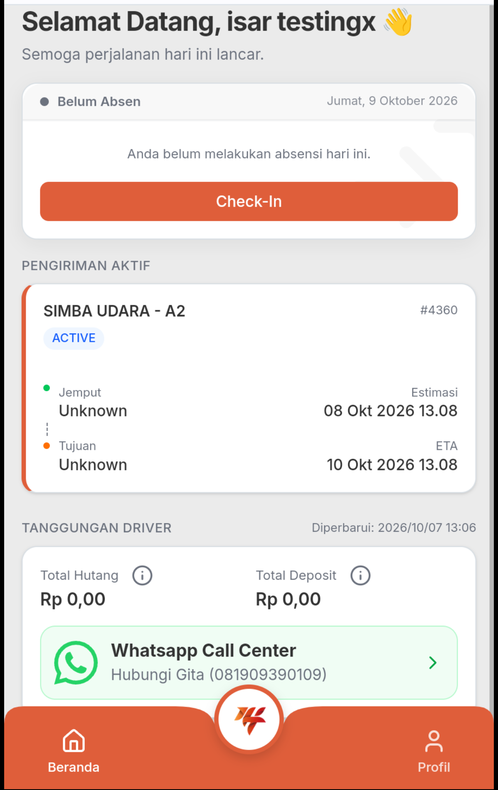{ style="height: 250px;" } |
    | **3.** Tempel (*paste*) atau masukkan 8-digit One-Time Token. | 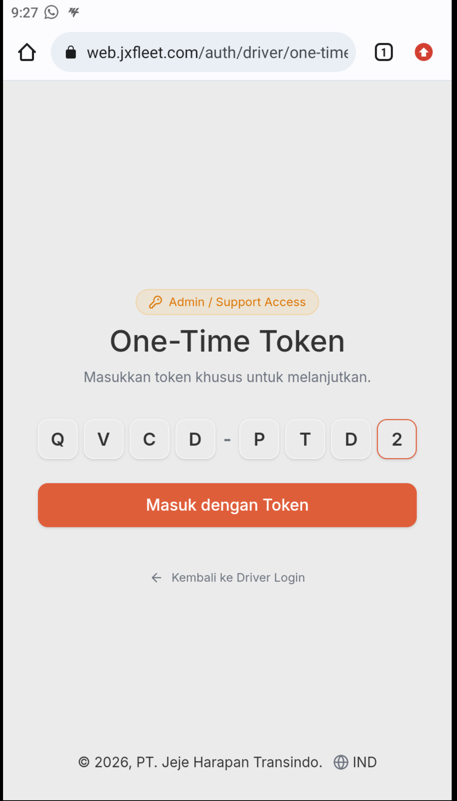{ style="height: 250px;" } |
    | **4.** Berhasil masuk ke halaman dashboard Mobile Web. | 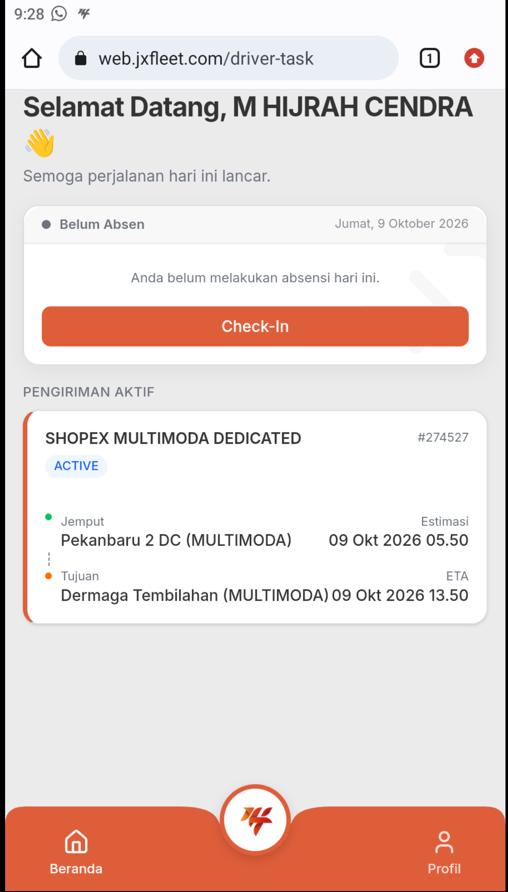{ style="height: 250px;" } |

---

!!! tip "Bantuan & Layanan Kendala"
    Jika Anda mengalami kendala saat masuk akun atau nomor belum terdaftar, silakan hubungi **Tim Pengembang JXFleet (JXFleet Developer Team)** atau manfaatkan panduan [🔑 Lupa Password](002-passwordLupa.md) / [📲 Lupa PIN](003-pinLupa.md).