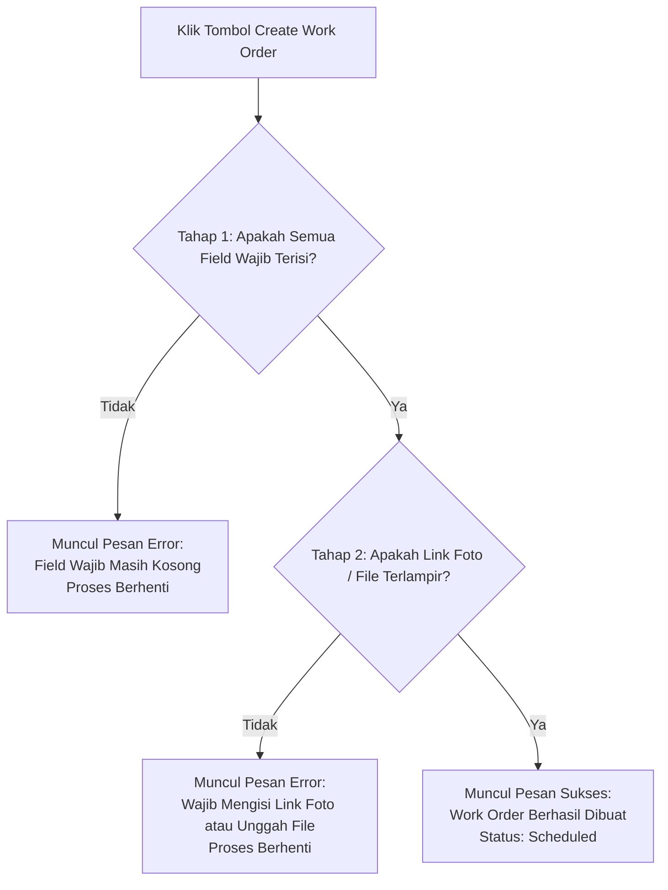

# Panduan Pembuatan Work Order Maintenance Truck

Panduan ini menjelaskan prosedur standar operasional bagi tim operasional dan manajemen armada (*fleet management*) dalam membuat tiket **Work Order (WO) Maintenance** untuk pemeliharaan dan perbaikan unit truk pada sistem **TMS (Transportation Management System)** PT Jeje Harapan Transindo.

---

!!! important "Persyaratan Sebelum Membuat Work Order"
    Sebelum mengajukan Work Order, pastikan:
    
    1. Nomor polisi kendaraan telah terdaftar aktif pada database armada TMS.
    2. Nomor SPK pengerjaan telah diterbitkan secara resmi.
    3. Anda telah menyiapkan minimal salah satu dokumen bukti: **Link Foto** *atau* **File Dokumen Perbaikan (PDF / JPG)**.

---

## 🛠️ Langkah-Langkah Pembuatan Work Order

### 1. Memulai Pembuatan Work Order
Buka modul **Truck Utilization** pada menu utama TMS, kemudian klik tombol **+ Add Maintenance** di sudut kanan atas layar untuk membuka formulir pembuatan tiket baru.

---

### 2. Mengisi Detail Identitas Order
Lengkapi rincian order pemeliharaan unit armada:

- **Nomor Polisi**: Pilih atau ketik nomor plat kendaraan armada yang akan diperbaiki.
- **Nomor SPK**: Masukkan nomor Surat Perintah Kerja (SPK) yang sesuai.
- **Jenis Work Order**: Tentukan klasifikasi perbaikan (misalnya: *Periodic Maintenance*, *Corrective*, atau *Emergency Repair*).
- **Trigger Work Order**: Pilih pemicu dilakukannya pemeliharaan (misalnya: *Jadwal Rutin (Scheduled)*, *Keluhan Driver*, atau *Temuan Inspeksi Lapangan*).

---

### 3. Mengatur Jadwal Pengerjaan
Tentukan estimasi durasi penanganan armada:

- **Jadwal Mulai Pengerjaan**: Tanggal dan waktu armada dijadwalkan masuk ke bengkel / area servis.
- **Jadwal Selesai Pengerjaan**: Estimasi tanggal dan waktu perbaikan armada ditargetkan selesai.

---

### 4. Melengkapi Informasi Armada & Lokasi Perbaikan
Catat posisi kilometer terkini dan lokasi fisik penanganan armada:

- **Angka Odometer (KM)**: Catat posisi angka kilometer aktual truk saat masuk pengerjaan.
- **Region Operasional**: Pilih wilayah operasional penugasan truk saat ini.
- **Lokasi Maintenance**: Tentukan lokasi fisik tempat armada diperiksa (misalnya: *Pool Cabang*, *Pangkalan*, atau *Bengkel Rekanan*).
- **Tujuan Workshop**: Pilih bengkel kerja internal atau rekanan resmi yang menangani armada.

---

### 5. Menambahkan Detail Teknis & Bukti Lampiran
Lengkapi detail mekanik dan dokumen pendukung kondisi armada:

- **Nama PIC Mekanik**: Masukkan nama teknisi atau mekanik utama yang bertanggung jawab.
- **Deskripsi Pekerjaan**: Tuliskan catatan perbaikan, gejala kerusakan, atau suku cadang yang perlu diganti.
- **Bukti Pendukung (Wajib Salah Satu)**:
    - **Link Foto**: Tautan penyimpanan online foto kondisi kerusakan armada.
    - **Unggah File Lampiran**: Unggah berkas dokumen pendukung resmi dalam format **PDF** atau **JPG**.

---

### 6. Menyimpan & Mengajukan Tiket
Setelah seluruh informasi terisi dengan benar, klik tombol **Create Work Order** untuk mengirimkan data ke sistem.

---

## 🔍 Tahapan Validasi Sistem

Saat tombol **Create Work Order** ditekan, sistem TMS akan menjalankan verifikasi otomatis dalam **dua tahap berurutan**:

### Penjelasan Rinci Tahap Validasi:

1. **Tahap 1 — Pengecekan Kolom Wajib (*Mandatory Fields*)**:
   - Sistem memverifikasi apakah ada data utama yang belum terisi (Nomor Polisi, SPK, Jenis WO, Odometer, Lokasi, dan Jadwal).
   - **Jika Ada yang Kosong**: Sistem menampilkan notifikasi kesalahan (*error message*) dan formulir tidak dapat diproses hingga data dilengkapi.
   - **Jika Seluruh Field Terisi**: Sistem otomatis melanjutkan ke tahap verifikasi kedua.

2. **Tahap 2 — Pengecekan Dokumen Lampiran (*Attachment Validation*)**:
   - Sistem memeriksa ketersediaan bukti perbaikan pada kolom **Link Foto** maupun berkas **Unggah File Maintenance**.
   - **Jika Keduanya Kosong**: Sistem menolak pengajuan dengan pesan kesalahan bahwa pengguna wajib menyertakan minimal salah satu dari kedua lampiran tersebut.
   - **Jika Salah Satu / Keduanya Terisi**: Sistem menerima pengajuan dan menampilkan notifikasi sukses: **"Work Order berhasil dibuat"**. Tiket kini tersimpan dengan status awal *Scheduled*.

---

## 📋 Tabel Referensi Kolom Formulir

| Nama Kolom / Field | Jenis Input | Status | Keterangan & Contoh Format |
| :--- | :--- | :--- | :--- |
| **Nomor Polisi** | Dropdown / Teks | **Wajib** | Nomor plat armada (contoh: `B 9123 JXT`) |
| **Nomor SPK** | Teks | **Wajib** | Nomor referensi dokumen SPK resmi |
| **Jenis Work Order** | Dropdown Pilihan | **Wajib** | Kategori perbaikan armada |
| **Trigger Work Order** | Dropdown Pilihan | **Wajib** | Alasan inisiasi perbaikan |
| **Jadwal Mulai** | Tanggal & Waktu | **Wajib** | Jadwal rencana unit masuk bengkel |
| **Jadwal Selesai** | Tanggal & Waktu | **Wajib** | Estimasi rencana unit selesai servis |
| **Odometer (KM)** | Angka Numerik | **Wajib** | Angka odometer aktual saat unit masuk servis |
| **Region** | Dropdown Pilihan | **Wajib** | Wilayah operasional armada |
| **Lokasi Maintenance** | Teks / Pilihan | **Wajib** | Lokasi fisik pengerjaan |
| **Tujuan Workshop** | Dropdown Pilihan | **Wajib** | Bengkel penanggung jawab pengerjaan |
| **PIC Mekanik** | Teks | Opsional | Nama teknisi / mekanik yang mengerjakan |
| **Deskripsi** | Area Teks (*Notes*) | Opsional | Rincian keluhan atau instruksi perbaikan |
| **Link Foto** | URL / Tautan | Kondisional* | Tautan penyimpanan foto armada |
| **Upload File** | Berkas (PDF / JPG) | Kondisional* | Berkas fisik SPK / bukti inspeksi servis |

> *\*Wajib mengisi minimal salah satu antara **Link Foto** atau **Upload File**.*

---

## 🔗 Panduan Terkait Modul Truck Utilization

- [📋 Panduan Update Status Scheduled ke Ongoing](draft.md)
- [✅ Panduan Penyelesaian Work Order (Status Completed)](draft.md)
- [📦 Panduan Bulk Upload Jadwal Maintenance Armada](draft.md)
- [🏠 Kembali ke Beranda Portal Wiki](../../index.md)