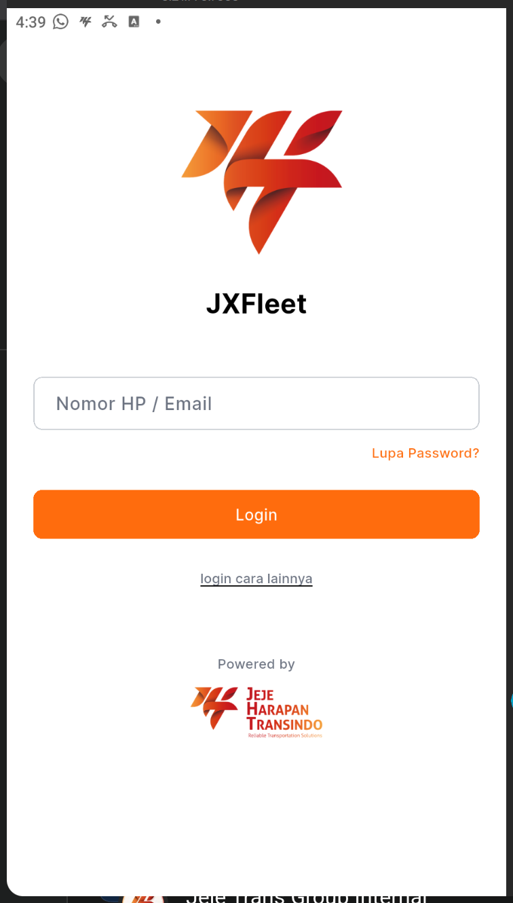

# Panduan Penulisan Dokumentasi Wiki (MkDocs)

Selamat datang di panduan resmi penulisan artikel dan dokumentasi sistem untuk **PT Jeje Harapan Transindo (Jeje Trans)**. Panduan ini dilengkapi dengan aturan struktur direktori terbaru, standar tata letak gambar, serta contoh sintaks kode beserta **Hasil Tampilan (Live Preview)** langsung yang dapat Anda lihat di halaman ini.

---

## 📁 1. Struktur Folder & Hirarki File

Seluruh berkas dokumentasi berformat Markdown (`.md`) disimpan di dalam direktori `/article` dengan hirarki bertingkat:

```
/article/
├── <Nama_Aplikasi_atau_Sistem>/
│   ├── index.md
│   ├── <Nama_Modul>/
│   │   ├── attachment/
│   │   │   ├── 001-namaLangkah-001.png
│   │   │   └── 001-namaLangkah-002.png
│   │   ├── 001-namaLangkah.md
│   │   └── 002-namaLangkahBerikutnya.md
```

### Aturan Penamaan & Pengorganisasian:
1. **Nama Folder Utama**: Gunakan nama sistem/modul yang ringkas dan konsisten (contoh: `JXFleet`, `TMS`, `FATTrack`).
2. **Subfolder Gambar (`attachment/`)**: Simpan seluruh gambar screenshot di dalam subfolder `attachment/` pada lokasi modul terkait.
3. **Pemanggilan Gambar**: Gunakan path relatif `attachment/nama-gambar.png` di dalam file `.md`.
4. **Penulisan Berkas Berurut**: Gunakan awalan angka berurut untuk panduan sekuensial (contoh: `001-login.md`, `002-passwordLupa.md`, `003-pinLupa.md`).

---

## 📝 2. Metadata Artikel (YAML Frontmatter)

Setiap file `.md` wajib diawali dengan blok metadata YAML di baris paling atas untuk menampilkan badge informasi penulis dan tanggal pembaruan:

### Sintaks Kode:
```yaml
---
title: Login Sistem JXFleet
author: Tim Pengembang Sistem
last_updated: 2026-10-09
---
```

### Hasil Tampilan (Preview):
*(Metadata di atas secara otomatis dirender sebagai badge informasi di bagian paling atas setiap artikel)*

---

## 🎨 3. Format Penulisan & Preview Tampilan

---

### A. Judul & Sub-Judul (Headings)

> [!NOTE]
> Daftar Isi (Table of Contents / TOC) di sisi kanan secara otomatis dibatasi hingga tingkat `##` (Level 2 Heading). Sub-judul tingkat 3 (`###`) dan 4 (`####`) tetap dapat ditulis untuk pengelompokan isi artikel.

#### Sintaks Kode:
```markdown
## Ini Adalah Sub-Bab Utama (H2)
### Ini Adalah Rincian Sub-Bab (H3)
#### Ini Adalah Sub-Sub-Bab (H4)
```

#### Hasil Tampilan (Preview):

## Ini Adalah Sub-Bab Utama (H2)
### Ini Adalah Rincian Sub-Bab (H3)
#### Ini Adalah Sub-Sub-Bab (H4)

---

### B. Memasukkan & Mengatur Ukuran Gambar

Gunakan sintaks persentase ukuran dan class `.center` agar gambar berada di posisi tengah layar dengan tampilan proporsional.

#### Sintaks Kode:
```markdown
{ width="30%" .center }
```

#### Hasil Tampilan (Preview):
{ width="30%" .center }

---

### C. Catatan & Peringatan (Admonitions / Callouts)

#### Sintaks Kode:
```markdown
> [!NOTE]
> Ini adalah contoh catatan informasi umum operasional.

> [!TIP]
> Ini adalah tips efisiensi atau trik mempercepat proses kerja.

> [!WARNING]
> Ini adalah peringatan mengenai potensi kesalahan pengguna (*user error*).

> [!IMPORTANT]
> Ini adalah prosedur kritis yang wajib dipatuhi demi keamanan data.
```

#### Hasil Tampilan (Preview):

> [!NOTE]
> Ini adalah contoh catatan informasi umum operasional.

> [!TIP]
> Ini adalah tips efisiensi atau trik mempercepat proses kerja.

> [!WARNING]
> Ini adalah peringatan mengenai potensi kesalahan pengguna (*user error*).

> [!IMPORTANT]
> Ini adalah prosedur kritis yang wajib dipatuhi demi keamanan data.

---

### D. Konten Mini Tab Antar Platform (Content Mini Tabs)

Gunakan sintaks `=== "Tab Title"` untuk membuat tab kecil interaktif dalam satu dokumen (contoh: memisahkan langkah untuk Komputer, Mobile App, dan Mobile Web).

#### Sintaks Kode:
```markdown
=== "💻 Komputer"
    1. Buka aplikasi di komputer atau browser desktop.
    2. Masukkan nomor HP dan PIN terdaftar.

=== "📱 Mobile App"
    1. Buka aplikasi **JXFleet Driver**.
    2. Masukkan nomor HP diawali `62` dan PIN 6-digit.

=== "🌐 Mobile Web"
    1. Buka situs `web.jxfleet.com`.
    2. Klik **Login as Driver** lalu masukkan nomor HP dan PIN.
```

#### Hasil Tampilan (Preview):

=== "💻 Komputer"
    1. Buka aplikasi di komputer atau browser desktop.
    2. Masukkan nomor HP dan PIN terdaftar.

=== "📱 Mobile App"
    1. Buka aplikasi **JXFleet Driver**.
    2. Masukkan nomor HP diawali `62` dan PIN 6-digit.

=== "🌐 Mobile Web"
    1. Buka situs `web.jxfleet.com`.
    2. Klik **Login as Driver** lalu masukkan nomor HP dan PIN.

---

### E. Blok Konten Buka-Tutup (Expand / Collapse Accordion)

#### Sintaks Kode:
```markdown
??? note "Klik untuk membuka / menutup rincian instruksi"
    Ini adalah rincian instruksi tambahan yang dapat dibuka atau ditutup pengguna.

???+ tip "Grup terbuka secara bawaan (Expand by Default)"
    Grup ini terbuka secara bawaan saat halaman dimuat, namun tetap dapat ditutup pengguna.
```

#### Hasil Tampilan (Preview):

??? note "Klik untuk membuka / menutup rincian instruksi"
    Ini adalah rincian instruksi tambahan yang dapat dibuka atau ditutup pengguna.

???+ tip "Grup terbuka secara bawaan (Expand by Default)"
    Grup ini terbuka secara bawaan saat halaman dimuat, namun tetap dapat ditutup pengguna.

---

### F. Penulisan Kode & Perintah Terminal

#### Sintaks Kode:
````markdown
```bash
# Mengecek status layanan kontainer
docker compose ps
```
````

#### Hasil Tampilan (Preview):

```bash
# Mengecek status layanan kontainer
docker compose ps
```

---

### G. Tabel Data

#### Sintaks Kode:
```markdown
| Parameter | Tipe Data | Keterangan |
| :--- | :--- | :--- |
| `phone_number` | String | Nomor HP terdaftar diawali `62` |
| `pin` | Number | 6-digit PIN akun driver |
| `status` | Enum | Active / Suspended |
```

#### Hasil Tampilan (Preview):

| Parameter | Tipe Data | Keterangan |
| :--- | :--- | :--- |
| `phone_number` | String | Nomor HP terdaftar diawali `62` |
| `pin` | Number | 6-digit PIN akun driver |
| `status` | Enum | Active / Suspended |

---

## 🚀 4. Alur Kerja Kontribusi (Git Workflow)

1. Buat atau perbarui file `.md` di folder modul terkait di bawah `/article/`.
2. Simpan seluruh file gambar screenshot pendukung di dalam folder `attachment/`.
3. Verifikasi penulisan dan pastikan metadata frontmatter terisi.
4. Commit dan push perubahan ke branch `main`:

```bash
git add .
git commit -m "docs: perbarui panduan operasional modul"
git push origin main
```
